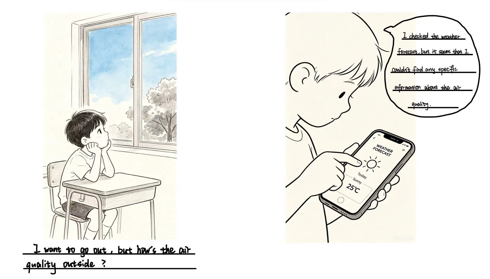
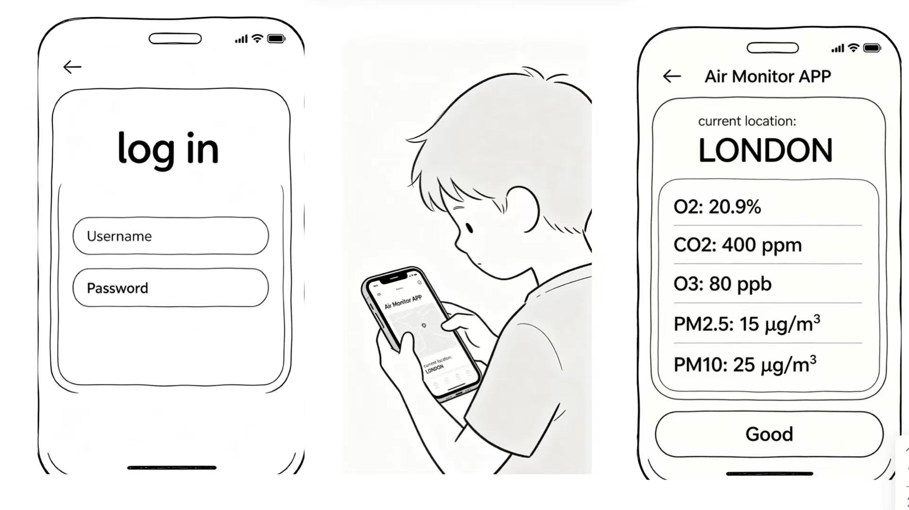
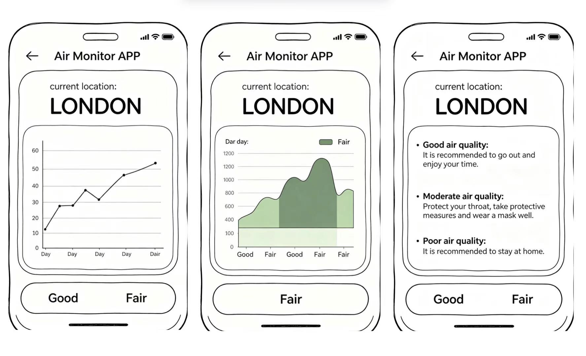
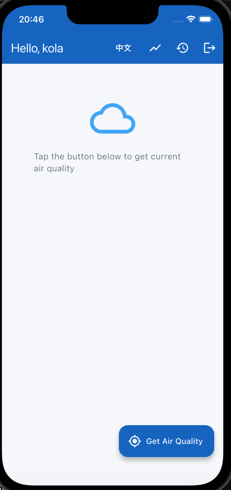
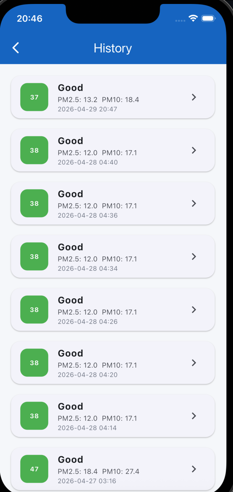
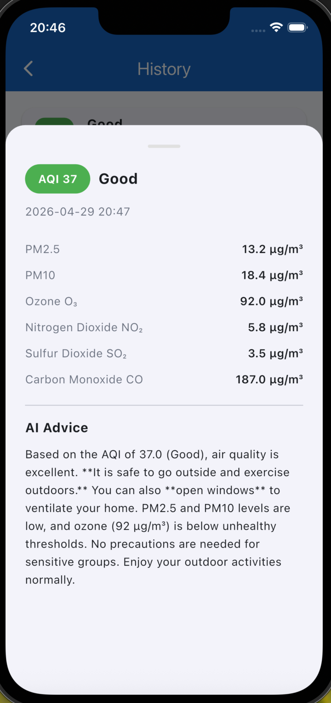
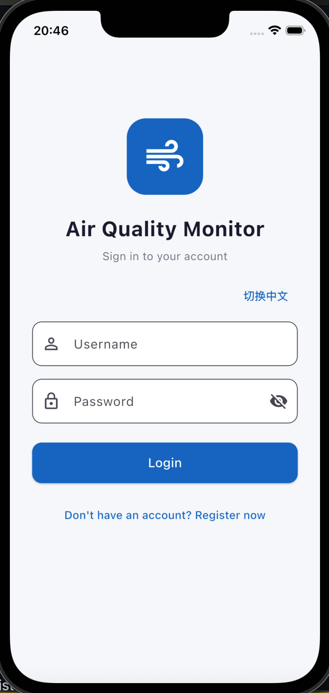

# Air Quality Monitor

## Introduction

Air Quality Monitor is a Flutter mobile application that helps users understand the air quality around their current location. The app uses mobile location sensing, real-time air quality data, local history storage, weekly trend visualisation, and AI-generated health advice to support everyday decisions such as whether to go outside, exercise outdoors, or open windows.

The main problem this app addresses is that many urban users make daily health and mobility decisions without checking local environmental conditions. Air quality can change across time and location, but this information is often not presented in a simple, actionable way. This app turns environmental data into clear, practical advice.

## Connected Environment Theme

This project fits the Connected Environment theme because it connects:

- The user's mobile device
- On-board location sensing
- Real-time environmental data
- External API services
- Local data storage
- AI-generated interpretation
- Repeated user interaction over time

The app does not only display data. It creates a feedback loop between the user, their physical environment, and digital services. The user can check the current environment, receive advice, save records, and review trends later.

## Key Features

- Splash screen and login/register flow
- Current location detection using the mobile device
- Real-time AQI and pollutant data
- Pollutant detail cards for PM2.5, PM10, Ozone, NO₂, SO₂, and CO
- AI health advice based on air quality data
- Local history records
- Weekly trend chart
- Detail bottom sheet for each historical record
- English and Chinese language switch
- Local API key configuration using `apikey.env`

## User Journey

The user journey is designed around a simple daily scenario:

1. The user opens the app before going outside.
2. The app checks whether the user is logged in.
3. The user taps **Get Air Quality**.
4. The app detects the current location and fetches real-time air quality data.
5. The user sees a clear AQI card and pollutant details.
6. The app provides AI-generated health advice.
7. The user can check historical records and weekly trends.
8. Over time, the app helps the user build awareness of their local air quality patterns.

This creates a repeat interaction pattern: users can return to the app before commuting, exercising, opening windows, or planning outdoor activity.

## Storyboarding

The initial concept was based on the idea of helping users make quick environmental decisions.

Suggested storyboard:

1. User wants to go outside.
2. User opens Air Quality Monitor.
3. App detects the current location.
4. App shows AQI and pollutant details.
5. App gives practical AI health advice.
6. User checks weekly trend.
7. User decides whether to go outside, exercise, or open windows.

### 1. Problem Context



### 2. App Interaction



### 3. Trends and Advice


## UI Design

The interface uses a card-based layout to make environmental data easy to understand. The AQI card gives the user an immediate summary, while pollutant cards provide more detailed information. The chart screen supports longer-term understanding, and the history screen lets the user review previous readings.

Main UI design choices:

- Large AQI number for quick understanding
- Green/yellow/red status colour logic
- Card-based pollutant details
- Floating action button for repeated data fetching
- Bottom sheet for detailed historical records
- Simple navigation icons for trend, history, language, and logout

## Screenshots

### Home Screen



### Weekly Trend


### History



### History Detail



### Login / Register



## Video Demo

The demo video shows the main user flow, including login, fetching air quality, viewing pollutant data, reading AI advice, checking weekly trends, viewing history records, and switching language.

[Watch the demo video](demo/app_demo.mp4)

## APIs and Services

This app uses several services and libraries:

- **Geolocator**: detects the user's current location.
- **Open-Meteo Air Quality API**: provides real-time air quality and pollutant data.
- **DeepSeek API**: generates practical AI health advice.
- **SQLite**: stores local air quality history records.
- **Flutter dotenv**: loads the local API key from `apikey.env`.

## Data Collection and Handling

The app uses location data only when the user requests air quality information. The latitude and longitude are used to fetch local environmental data. Air quality records are stored locally using SQLite, including AQI, pollutant values, AI advice, timestamp, and location.

The real AI API key is not committed to GitHub. The project includes `apikey.env.example` to show the required configuration, while the real `apikey.env` file is ignored by Git.

## API Key Configuration

To run the AI advice feature, create a local file named:

```text
apikey.env
